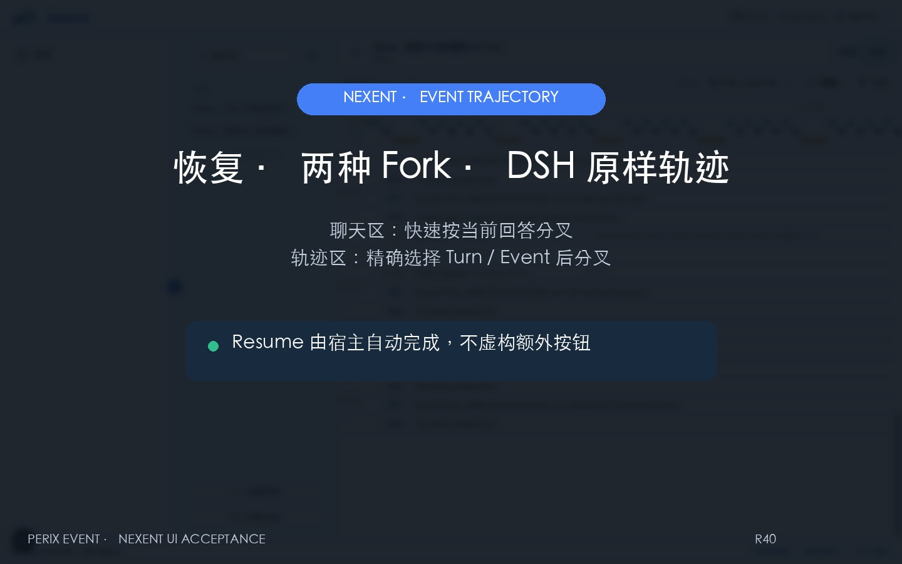

# Nexent Event 轨迹恢复与 Fork Demo

[](trajectory-restore-fork-demo.mp4)

▶ [直接播放或下载 MP4](trajectory-restore-fork-demo.mp4)

这段 101 秒 Demo 展示同一套真实 Event 数据如何进入 Nexent 产品页面：先看
完整轨迹与右侧 Schema 详情，再验证跨进程冷恢复，最后分别从聊天回答和轨迹
Event 两个入口执行真实 Fork。视频包含普通话旁白、同步字幕，以及用于指示操作
目标的鼠标、点击波纹和高亮。

画面来自 1440×900 真实浏览器验收：聊天 Fork 和轨迹 Fork 均实际点击并进入
子会话，错误边界会被测试桩拒绝。为让动作在文档视频中清楚可见，鼠标移动、
点击波纹、高亮和字幕为后期指示层；底层页面、按钮状态、选择值、导航结果与
Event 内容均来自对应操作前后的真实页面，不把它表述为未经剪辑的屏幕录像。

## 章节

| 时间 | 内容 | 重点 |
| --- | --- | --- |
| 00:00 | 导览 | DSH 原样轨迹、自动 Resume 和两个 Fork 入口 |
| 00:14 | 完整轨迹 | Session、时间线、Turn/Tool 层级与右侧 Schema 详情 |
| 00:32 | 中断恢复 | 进程 A 的 10 Turn 冷恢复为同一 Session 的 21 Turn |
| 00:52 | 聊天快捷 Fork | 在第 20 轮回答旁显示按钮、点击并进入子会话 |
| 01:08 | 轨迹精确 Fork | 选择“第 20 轮 · Event 188”、点击并核对父子血缘 |
| 01:25 | 验证摘要 | 两个入口的共同边界、DSH 一致性与测试结果 |

## 两个 Fork 入口

- **聊天快捷 Fork**：放在已完成助手回答旁，采用 DSH 的消息级入口语义；适合
  日常从当前回答快速分支。
- **轨迹精确 Fork**：位于 DSH `EventTrajectory` 外层的 Nexent 宿主栏；下拉框
  列出每个完成 Turn 及其 Event seq，适合审计、调试和长轨迹定位。

两者都调用同一个 Event Fork 接口。Demo 中两条路径都选择第 20 轮的稳定边界
`Event 188`，子 Session 继承 `189` 个 Event。DSH 轨迹组件内部没有为此改动。

## Demo 中的“恢复”是什么

恢复不是一个前端按钮。进程 A 写入 `nexent-r39-parent` 的前 10 个 Turn 后退出；
全新的进程 B 使用相同 Session ID 调用持久化层恢复，再继续写入到第 21 个 Turn。
这与 DSH 的自动宿主 Resume 语义一致。页面右上角“刷新”只负责重新读取后端
已经恢复并续写的 Event，不能把它称作 Resume。

- 恢复前：10 个完成 Turn、97 个 Event。
- 恢复后：同一父 Session，21 个完成 Turn、197 个 Event；新增后缀为
  `restored-21`。
- Fork 边界：子 Session `nexent-r39-fork` 精确继承前 189 个 Event，并记录
  `parentSession=nexent-r39-parent`、`seedLength=189`。
- Fork 后：子 Session 独立写入 `fork-21`；父子继承前缀逐 Event 相等。

## 数据来源与边界

轨迹由 Nexent v2.5.0 本地实验分支的真实 `CoreAgent` 和 `perix-event-sdk` 生成，
恢复、持久化和 Fork 均经过实际 Python 进程。生成轨迹时使用的四个独立命令形状
如下，其中第二个命令负责冷恢复并在完成 Turn 边界创建子 Session：

```bash
python test/sdk/core/agents/test_event_trajectory.py \
  --long-event-worker "$FIXTURE_ROOT" nexent-r39-parent 1 10 -
python test/sdk/core/agents/test_event_trajectory.py \
  --long-event-worker "$FIXTURE_ROOT" nexent-r39-parent 11 10 nexent-r39-fork
python test/sdk/core/agents/test_event_trajectory.py \
  --long-event-worker "$FIXTURE_ROOT" nexent-r39-parent 21 1 -
python test/sdk/core/agents/test_event_trajectory.py \
  --long-event-worker "$FIXTURE_ROOT" nexent-r39-fork 21 1 -
```

Nexent 页面外围的 user、agent 和 conversation HTTP 数据来自确定性本地验收桩；
画面中的 Event 记录、恢复结果、工具 Schema、Fork 数据和 Trajectory UI 投影不是
桩数据。Nexent 修改只保存在无 remote 的本地实验分支，没有推送或部署到官方
项目。

## 审计证据

| 对象 | SHA-256 |
| --- | --- |
| 恢复前父 Session JSONL | `f00e0b9ef7ae5e79b3e21d0e85946fb0f009b51b0eb477f676dc4599b37ba940` |
| 最终父 Session JSONL | `5bd9cffa495667ae49b0b51623c5a6f668bace79ea2c2cf18f76972641664b74` |
| 最终子 Session JSONL | `ac19f80cf285ca9607f51402b64fae43910647fae30086e1ccdd584f1aca8530` |
| [`trajectory-restore-fork-demo.mp4`](trajectory-restore-fork-demo.mp4) | `a1340fb17b620f451e126e3246ee9f9fb75864bee1a70af161131490eeb98c6c` |
| [`cover.jpg`](cover.jpg) | `046a6bded8dcdeb5147635c93358662c15387fd843189aacc5377c02d96c09c6` |

MP4 为 H.264 High / yuv420p、1440×900、15 fps；声音为 AAC-LC、48 kHz、
单声道、128 kb/s。实测时长 `00:01:40.63`，大小约 3.1 MiB；平均音量
`-15.8 dB`，峰值 `-1.4 dB`。完整解码、音轨和关键帧复核命令：

```bash
ffmpeg -v error -i trajectory-restore-fork-demo.mp4 -f null -
ffmpeg -i trajectory-restore-fork-demo.mp4 -map 0:a:0 \
  -af volumedetect -f null -
ffmpeg -ss 00:00:48 -i trajectory-restore-fork-demo.mp4 \
  -frames:v 1 restore-keyframe.jpg
ffmpeg -ss 00:00:58 -i trajectory-restore-fork-demo.mp4 \
  -frames:v 1 chat-fork-keyframe.jpg
ffmpeg -ss 00:01:17 -i trajectory-restore-fork-demo.mp4 \
  -frames:v 1 precise-fork-keyframe.jpg
shasum -a 256 trajectory-restore-fork-demo.mp4 cover.jpg
```

更完整的测试与浏览器证据见
[`R38 任务书`](../../tasks/R38-nexent-long-trajectory.md)；本 Demo 的制作和验收
记录见 [`R39 任务书`](../../tasks/R39-nexent-trajectory-demo.md) 与
[`R40 任务书`](../../tasks/R40-nexent-narrated-interaction-demo.md)。
